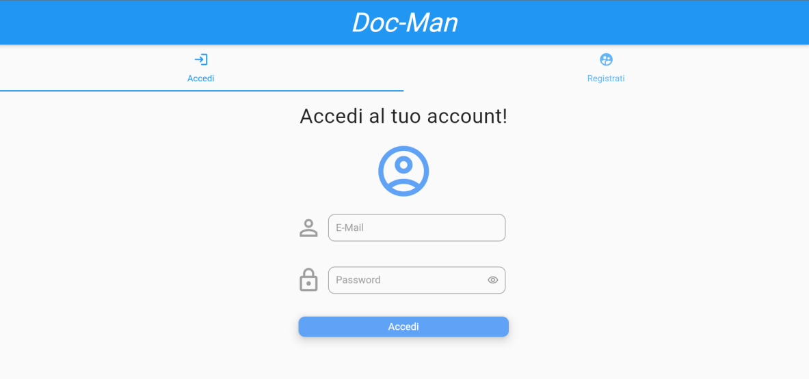
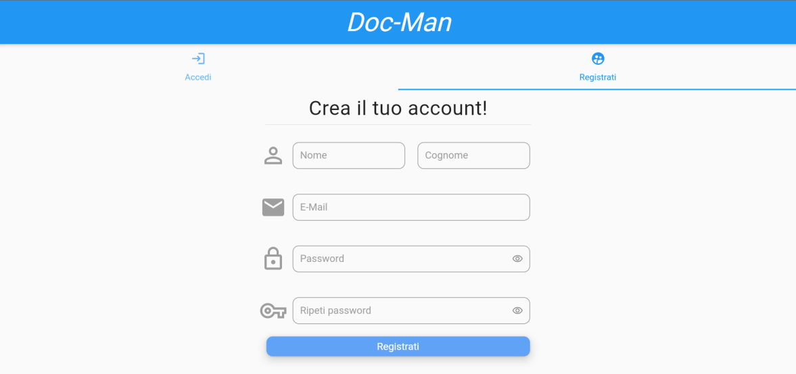
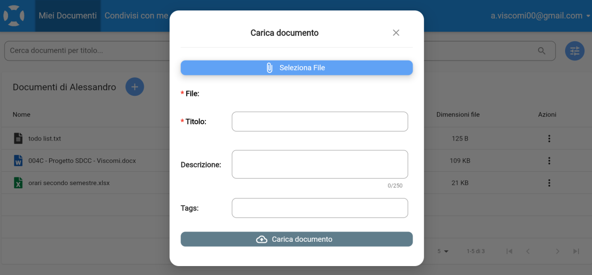
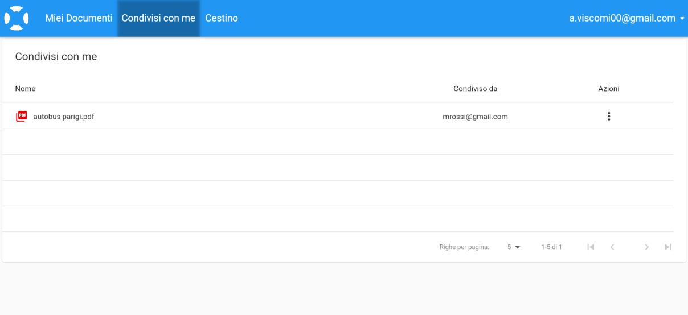
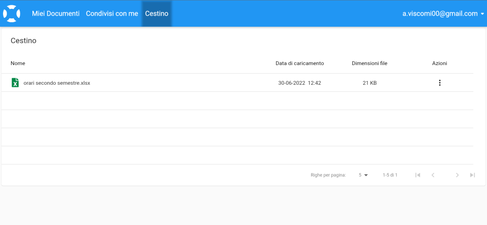

# Doc-Man: manage and share your documents

*Project related to the '**Distributed Systems and Cloud Computing**' exam @ **University of Calabria***

Doc-Man is a web application inspired by Google Drive, which allows you to manage and share documents in various formats, storing them in the Cloud. For each document, you can add information such as a description and a set of tags to classify them. Through these tags, it's possible to easily search for uploaded documents. You can also search by the document's title. Additionally, you can assign read permissions to other users; a user with whom a document has been shared can view its information (description and tags) and download it

Once logged into the restricted area, Doc-Man provides three main screens:

- **My Documents:**  
Through this page, the user can view the documents they have uploaded (sorted by upload date), along with some information, including file size. For each document, there is also an 'actions' button, through which the user can download the file, view and edit information, access the file sharing center to assign read permissions to users, or move the file to the trash.  
Additionally, the user can filter documents based on the title and/or advanced filters - accessible via a dedicated button - and upload new files through the '+' button;

- **Shared with me:**  
On this page, the user can view documents that have been shared with them. For these documents, the user can download them and view their information. Additionally, if they do not wish to keep them, they can remove them;

- **Bin:**  
Here, the user can find items they had uploaded and subsequently deleted. For each of these, they can choose to restore them - bringing them back to the 'My Documents' page - or to delete them permanently.

## Technologies Used

- **Backend:**&emsp;&emsp;&emsp;&emsp;SpringBoot

- **Frontend:**&emsp;&emsp;&emsp;&ensp; Flutter

- **DBMS:**&emsp;&emsp;&emsp;&emsp;&emsp; MySQL

- **Autenticazione:**&emsp;Keycloak

- **Cloud:**&emsp;&emsp;&emsp;&emsp;&emsp;&ensp;Amazon AWS

## Images

*Figure 1: Login Screen*

*Figure 2: Registration Screen*

*Figure 3: "My Documents" Screen*

*Figure 4: "Load Document" Screen*

*Figure 5: "Shared with me" Screen*

*Figure 6: "Bin" Screen*
